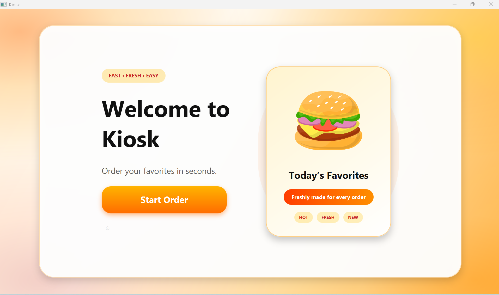
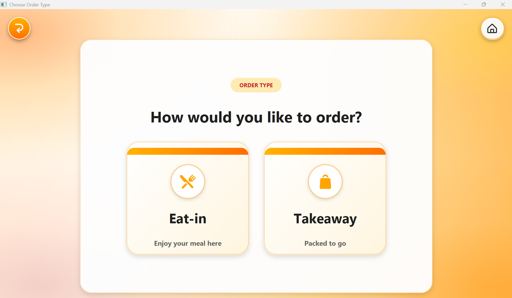
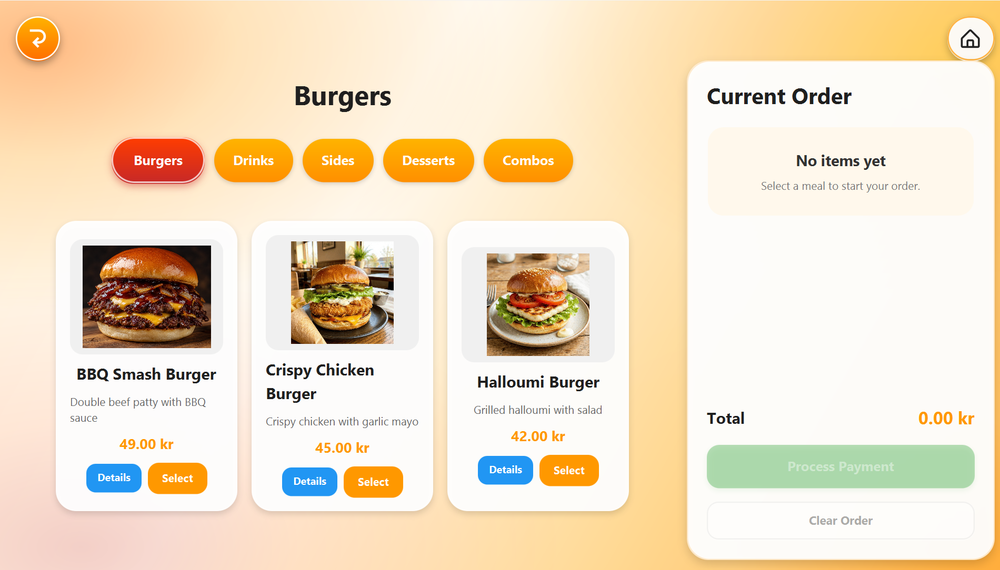
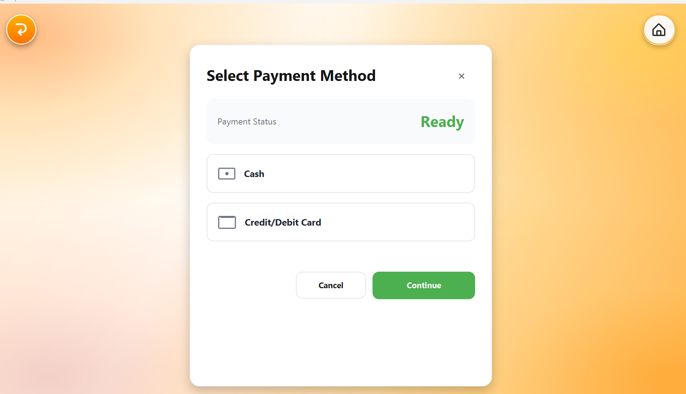
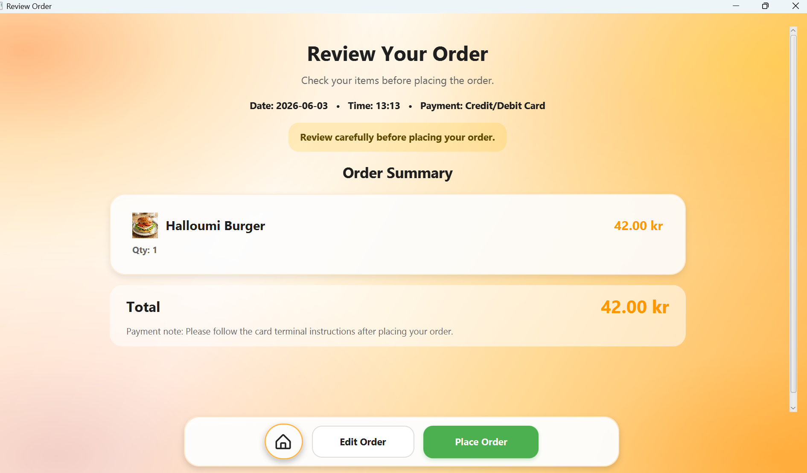
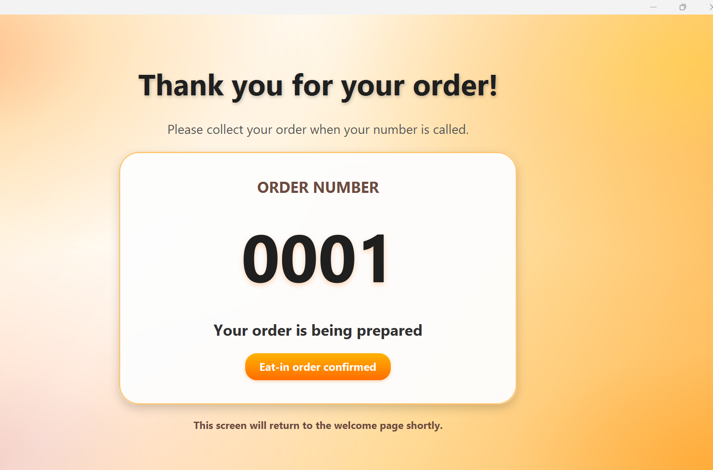
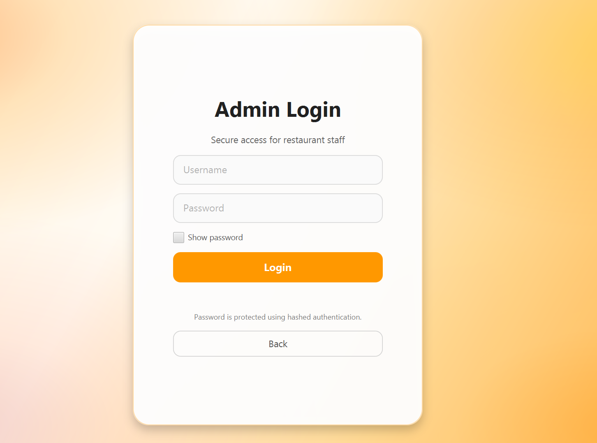
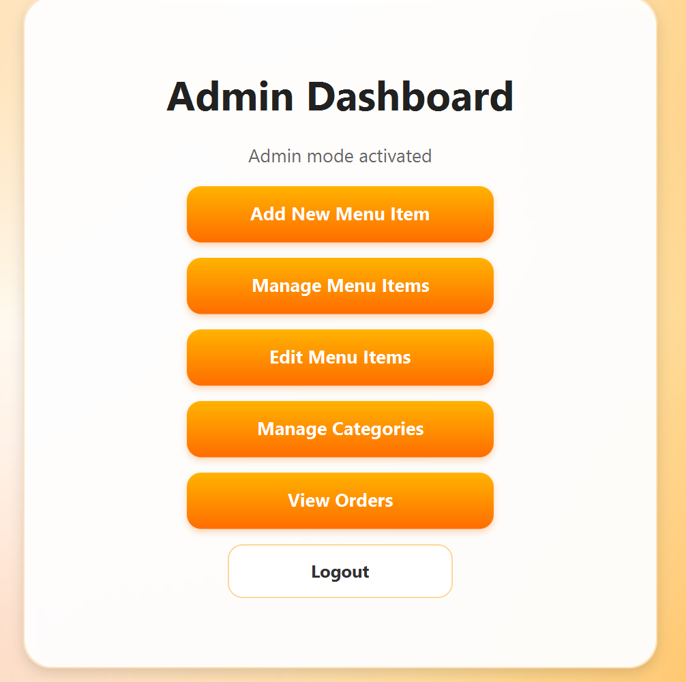
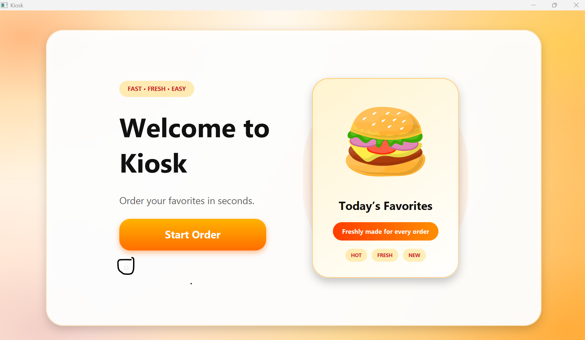

# Sphinx Kiosk - Setup & Usage Guide

## Table of Contents

* [Project Description](#project-description)
* [User Stories](#user-stories)
* [Prerequisites](#prerequisites)
* [Installation & Setup](#installation--setup)
* [Running the Application](#running-the-application)
* [Database](#database)

    * [Main Database Tables](#main-database-tables)
    * [Database Purpose](#database-purpose)
* [Admin Panel](#admin-panel)

    * [Accessing the Admin Panel](#accessing-the-admin-panel)
    * [Admin Login Details](#admin-login-details)
    * [Admin Dashboard](#admin-dashboard)
    * [Adding New Menu Items](#adding-new-menu-items)
    * [Managing Menu Items](#managing-menu-items)
    * [Editing Menu Items](#editing-menu-items)
    * [Managing Categories](#managing-categories)
    * [Viewing Orders](#viewing-orders)
* [Customer Experience](#customer-experience)

    * [Starting an Order](#starting-an-order)
    * [Choosing Items](#choosing-items)
    * [Customizing Items](#customizing-items)
    * [Current Order Panel](#current-order-panel)
    * [Payment and Review](#payment-and-review)
    * [Order Completion](#order-completion)
* [Implemented Features](#implemented-features)

    * [Customer Features](#customer-features)
    * [Admin Features](#admin-features)
    * [Database Features](#database-features)
    * [UI and Design Features](#ui-and-design-features)
* [Design and Architecture](#design-and-architecture)

    * [Application Flow Diagram](#application-flow-diagram)
    * [Main Customer Screens](#main-customer-screens)
    * [Main Admin Screens](#main-admin-screens)
    * [Shared Styling](#shared-styling)
* [Screenshots](#screenshots)
* [Project Structure](#project-structure)
* [Testing and Validation](#testing-and-validation)
* [Additional Notes](#additional-notes)
* [Development Process](#development-process)
* [Team](#team)

---

## Project Description

Sphinx Kiosk is a JavaFX self-service food ordering kiosk application made for a fast-food restaurant. The idea is that customers can place an order through the kiosk instead of ordering directly at the counter.

The customer can start an order, choose eat-in or takeaway, browse menu categories, select items, customize meals, check the current order, choose a payment method, review the order, and receive an order number.

The application also includes an admin section where restaurant staff can manage menu items, categories, prices, images, availability, and incoming orders. The project uses an SQLite database to store menu data and changes made from the admin side.

The main purpose of the system is to make the ordering process easier for customers and make menu management easier for staff.

---

## User Stories

The project was managed using GitLab Issues. In total, the team created and completed 42 issues. These included customer user stories, admin user stories, improvements, and technical tasks.

This section gives an overview of the main user stories. The full list of issues and sprint work can be found in GitLab.

### Customer User Stories

* As a customer, I want to view categories so that I can browse the menu easily.
* As a customer, I want to select a category so that I can view items from that category.
* As a customer, I want to view the item list so that I can choose a product.
* As a customer, I want to see the item name and price so that I understand what I am ordering.
* As a customer, I want to see item details so that I can recognize the product.
* As a customer, I want to select a meal so that I can start customizing my order.
* As a customer, I want to choose a drink so that I can complete my meal.
* As a customer, I want to choose my portion or combo size so that I can control my meal.
* As a customer, I want to add extras so that I can customize my order.
* As a customer, I want to remove ingredients so that the meal fits my preference.
* As a customer, I want to choose the quantity so that I can order the correct amount.
* As a customer, I want to add items to my current order so that I can build my order.
* As a customer, I want my current order to remain saved when I navigate between screens so that I do not lose my order.
* As a customer, I want identical items to be combined in my current order so that the order stays organized and easy to read.
* As a customer, I want to remove items from my current order so that I can fix mistakes.
* As a customer, I want to increase or decrease item quantity so that I can adjust my order.
* As a customer, I want to see the price per item based on quantity so that I understand the cost breakdown.
* As a customer, I want the total price to update automatically when my current order changes so that I always see the correct amount.
* As a customer, I want to view the total price so that I know the final cost.
* As a customer, I want to view an order summary so that I can check my selected items before placing order.
* As a customer, I want the system to prevent invalid order actions, such as reducing quantity below 1 or confirming an empty order, so that I can complete my order correctly.
* As a customer, I want to choose a payment method so that I can complete my order.
* As a customer, I want to confirm my order so that it is sent for processing and I can be sure my order has been successfully placed.
* As a customer, I want to see a confirmation screen so that I know the order worked.
* As a customer, I want to receive an order number so that I can identify my order.
* As a customer, I want the system to reset after my order so that the next user can start.
* As a customer, I want to see a message when my current order is empty so that I understand that no items are selected.
* As a customer, I want a home button so that I can return to the start.

### Admin User Stories

* As an admin, I want to access admin mode from the system so that I can manage content.
* As an admin, I want to add new menu items so that new products can be offered.
* As an admin, I want to view all menu items so that I can manage the menu.
* As an admin, I want to update menu items so that I can change the price or name.
* As an admin, I want to delete menu items so that I can remove products.
* As an admin, I want to create categories so that the menu can be organized.
* As an admin, I want to assign items to categories so that they appear correctly.
* As an admin, I want to set item prices so that the cost is correct.
* As an admin, I want to add item images so that items look appealing.
* As an admin, I want to set item availability so that unavailable items are hidden.
* As an admin, I want to modify existing items so that the menu stays updated.
* As an admin, I want to manage all content from the system so that no manual database work is needed.
* As an admin, I want to view incoming orders so that customer orders can be tracked.
* As an admin, I want to mark orders as completed so that staff can manage order status.

---

## Prerequisites

Before running the project, make sure you have:

* IntelliJ IDEA installed
* Java installed
* Gradle available through the project
* The project cloned from GitLab

---

## Installation & Setup

1. Clone the repository from GitLab.

   ```bash
   git clone <repository-url>
   ```

2. Open the project in IntelliJ IDEA.

3. Make sure the project is opened from the correct root folder where the Gradle files are located.

4. Wait for IntelliJ to load and sync Gradle.

5. If Gradle does not load automatically, refresh the Gradle project from the Gradle panel.

---

## Running the Application

The application can be run in different ways.

### Option 1: IntelliJ Gradle Menu

1. Open the Gradle panel on the right side of IntelliJ.

2. Go to:

   ```text
   app → Tasks → application → run
   ```

3. Double-click `run`.

### Option 2: IntelliJ Run Button

1. Open the main application file.
2. Click the green run button if IntelliJ detects the application configuration.

### Option 3: Terminal

On Windows:

```bash
gradlew run
```

On macOS/Linux:

```bash
./gradlew run
```

When the application starts, the welcome screen should appear.

---

## Database

The project uses SQLite as the database.

Database file:

```text
kiosk.db
```

The database is initialized through:

```text
DatabaseInitializer.java
```

The main database-related classes are located in:

```text
app/src/main/java/se/lnu/database
```

### Main Database Tables

The main database tables include:

* `Category`
* `MenuItem`
* `ExtraOption`
* `RemovableIngredient`
* `MenuItemExtraOption`
* `MenuItemRemovableIngredient`
* `ComboChoiceGroup`
* `ComboChoiceOption`

### Database Purpose

The database stores:

* Menu categories
* Menu items
* Item descriptions
* Item prices
* Item images
* Item availability
* Optional extras
* Removable ingredients
* Combo choices
* Category connections
* Admin menu changes
* Customer order information

Default menu data is inserted when the `MenuItem` table is empty. Admin-added menu items are saved to the database and should remain after restarting the application.

The customer side and admin side use the same SQLite database. This means that changes made from the admin side, such as adding an item, changing a price, or setting an item as unavailable, can be shown on the customer side.

---

## Admin Panel

The admin panel is used by restaurant staff to manage menu data and view customer orders.

### Accessing the Admin Panel

1. Open the application.
2. From the welcome screen, access the admin login.
3. Enter the admin credentials.
4. After successful login, the admin dashboard is displayed.

The admin login is used to protect the staff-only part of the application.

### Admin Login Details

For testing and evaluation, the admin panel can be accessed with:

```text
Username: admin
Password: Admin@2026
```

The password is checked using hashed authentication in the application. These login details are only for the course prototype.

---

### Admin Dashboard

The admin dashboard gives access to:

* Add new menu items
* Manage existing menu items
* Edit menu items
* Manage categories
* View orders
* Log out and return to the welcome screen

---

### Adding New Menu Items

1. From the admin dashboard, click Add New Menu Item.
2. Enter the required product details:

    * Item name
    * Description
    * Price
    * Category
    * Image, if needed
3. Click Save Menu Item.
4. The new item is saved to the database.
5. The item appears on the customer side under the selected category.

This allows staff to add new products without changing the database manually.

---

### Managing Menu Items

1. From the admin dashboard, click Manage Menu Items.
2. Select a category.
3. View the menu items in that category.
4. Delete products that should no longer be sold, if needed.

This screen is used for managing existing products.

---

### Editing Menu Items

1. From the admin dashboard, click Edit Menu Items.
2. Select an existing menu item.
3. Edit item information such as:

    * Name
    * Description
    * Price
    * Image
    * Availability
4. Save the changes.

If an item is marked as unavailable, it should not be shown to customers.

---

### Managing Categories

1. From the admin dashboard, click Manage Categories.
2. View existing categories.
3. Add a new category if needed.
4. Delete categories if needed.

Categories are used to organize menu items on the customer side.

Examples of categories:

* Burgers
* Drinks
* Sides
* Desserts
* Combos

---

### Viewing Orders

The admin panel includes an incoming orders screen. Staff can use this screen to view customer orders and mark them as completed.

If there are no pending orders, the screen shows that all customer orders are completed.

---

## Customer Experience

### Starting an Order

1. Start the application.
2. Click Start Order on the welcome screen.
3. Choose either Eat-in or Takeaway.

The selected order type is used during the ordering flow.

---

### Choosing Items

1. Select a menu category:

    * Burgers
    * Drinks
    * Sides
    * Desserts
    * Combos
2. Choose a menu item.
3. View the item details or select the item.

Each menu item includes information such as name, description, price, and image.

---

### Customizing Items

Depending on the selected item, customers may be able to:

* Add optional extras
* Remove ingredients
* Choose combo options
* Change quantity

After customization, the item can be added to the current order.

---

### Current Order Panel

Instead of using a separate cart page during the main ordering flow, the application shows a current order panel beside the menu. This allows the customer to see selected items while still browsing the menu.

The current order panel includes:

* Item name
* Item image
* Quantity
* Item price
* Total price
* Edit option
* Remove option

The panel also prevents the customer from continuing to payment when no items have been selected.

---

### Payment and Review

After items have been added, the customer can continue to payment.

The payment flow includes:

1. Selecting a payment method.
2. Choosing either cash or credit/debit card.
3. Reviewing the order summary.
4. Checking the total price.
5. Placing the order.

The review order screen gives the customer one final chance to check the order before it is submitted.

---

### Order Completion

After the order is placed, the customer receives an order number.

The order number screen displays the order number briefly and then returns to the welcome screen. This resets the kiosk for the next customer.

---

## Implemented Features

### Customer Features

* Welcome screen with start order button
* Eat-in or takeaway order type selection
* Menu category browsing
* Item cards with name, description, price, and image
* Item details screen
* Optional extras for menu items
* Removable ingredients for menu items
* Combo meal selection
* Current order panel with item details, quantity, and total price
* Quantity increase and decrease controls
* Remove item option
* Edit item option
* Empty current order message
* Payment method selection
* Review order screen before placing the order
* Order confirmation screen
* Order number screen
* Automatic return/reset after order completion

---

### Admin Features

* Admin login
* Hashed password authentication for admin access
* Admin dashboard
* Add new menu items
* Manage existing menu items
* Edit menu item name, description, price, image, and availability
* Manage categories
* View incoming customer orders
* Mark customer orders as completed
* Save menu and category changes to the database
* Database persistence so admin-added items can remain after restarting the app
* Availability filtering so unavailable items are hidden from the customer side

---

### Database Features

* SQLite database integration
* Automatic database initialization
* Default menu data seeding
* Menu item storage
* Category storage
* Optional extras storage
* Removable ingredients storage
* Combo choice storage
* Admin-added menu item persistence
* Customer order storage
* Availability filtering for customer-side menu items

---

### UI and Design Features

* Kiosk-style interface
* Large buttons for easier use
* Orange/yellow color theme
* Rounded cards and buttons
* Shared background style
* Consistent navigation buttons
* Separate customer and admin flows
* Welcome screen as the starting point
* Eat-in and takeaway order type cards
* Current order panel during ordering
* Payment method window
* Review order screen before placing the order
* Automatic reset after order completion

---

## Design and Architecture

The application is built using separate JavaFX screens. Each screen handles one part of the customer or admin flow.

Navigation is handled by calling the `show(Stage stage)` method of the different screen classes.

The system is divided into three main parts:

1. Customer-side ordering flow
2. Admin-side menu management and order handling flow
3. SQLite database layer

The customer side is responsible for the ordering process. The admin side is responsible for managing menu data and orders. Both sides use the same database, which keeps the menu data connected across the system.

---

### Application Flow Diagram

#### Customer Flow

```text
Welcome Screen
  ↓
Order Type Screen
  ↓
Category Screen
  ↓
Item Details / Meal Selection
  ↓
Current Order Panel
  ↓
Payment Method
  ↓
Review Order
  ↓
Order Number Screen
  ↓
Welcome Screen
```

#### Admin Flow

```text
Welcome Screen
  ↓
Admin Login
  ↓
Admin Dashboard
  ↓
Add / Edit / Manage Menu Items
  ↓
Manage Categories
  ↓
View Orders
  ↓
SQLite Database
  ↓
Customer Side Updated
```

#### Database Connection Flow

```text
Admin Action
  ↓
Database Update
  ↓
Menu Data Stored in SQLite
  ↓
Customer Side Reads Updated Data
```

---

### Main Customer Screens

Examples of customer-side screens:

* `WelcomeScreen`
* `OrderTypeScreen`
* `CategoryScreen`
* `ItemDetailsScreen`
* `MealSelectionScreen`
* `PaymentScreen`
* `OrderConfirmationScreen`
* `OrderNumberScreen`

The current order panel is part of the customer ordering flow and is shown beside the menu during ordering.

---

### Main Admin Screens

Examples of admin-side screens:

* `AdminLoginScreen`
* `AdminDashboardScreen`
* `AdminAddMenuItemScreen`
* `AdminMenuItemsScreen`
* `CategoryAdminScreen`
* `ItemEditorScreen`
* `AdminOrdersScreen`

---

### Shared Styling

The project uses a shared style helper class:

```text
ScreenStyle.java
```

This class is used to keep the screens visually consistent. It contains shared styling for:

* Backgrounds
* Cards
* Buttons
* Navigation buttons

---

## Screenshots

Screenshots are included to show the final customer and admin interfaces.

### Welcome Screen



### Order Type Screen



### Customer Order Screen



### Payment Method Screen



### Review Order Screen



### Order Number Screen



### Admin Login Screen



### Admin Dashboard



### Admin Access Button



---

## Project Structure

```text
app/src/main/java/org/example
```

Contains the main application entry point used to start the JavaFX application.

```text
app/src/main/java/se/lnu
```

Contains the main customer-side screens, models, current order logic, application flow, and shared styling.

```text
app/src/main/java/se/lnu/admin
```

Contains admin-related screens such as login, dashboard, add menu item screen, menu item management, item editing, category management, and order viewing.

```text
app/src/main/java/se/lnu/database
```

Contains database connection, database helper methods, and database initialization logic.

```text
app/src/main/resources
```

Contains resources used by the application, such as images or other UI assets.

---

## Testing and Validation

The application was tested manually during the sprint process.

Main tested flows include:

* Starting a customer order
* Selecting order type
* Browsing categories
* Opening item details
* Adding optional extras
* Removing ingredients
* Choosing combo options
* Adding items to the current order
* Updating item quantity
* Removing items from the order
* Checking total price updates
* Preventing invalid order actions
* Selecting a payment method
* Reviewing the order before placing it
* Completing the order flow
* Showing order number
* Returning to the welcome screen after order completion
* Admin login
* Adding a new menu item
* Checking that newly added items appear on the customer side
* Editing item details, price, image, and availability
* Managing categories
* Viewing incoming orders
* Checking database persistence after restarting the application

Manual testing was done during development and before the final presentation.

---

## Additional Notes

* The application is designed as a course project and prototype.
* Admin login is included for staff access.
* For this course prototype, the admin password is protected using hashed authentication.
* The database is initialized automatically when the application runs.
* Default data is inserted when the `MenuItem` table is empty.
* Admin-added items should remain saved after restarting the app.
* Images can be added or selected for menu items where applicable.
* Availability controls whether a menu item is visible to customers.
* In a real system, authentication, payment handling, and order processing would need more security and external service integration.

---

## Development Process

This project was developed as a group project using an agile/scrum workflow. The team worked through multiple sprints and improved the application step by step.

The development process included:

* Sprint planning
* User story selection
* Branch-based development
* GitLab merge requests
* UI improvements
* Database integration
* Admin feature development
* Manual testing
* Final documentation

GitLab Issues were used to track user stories, improvements, and technical tasks. Merge requests and branch-based development were used to organize changes and reduce conflicts during the project.

---

## Team

Sphinx Group

* Ambreen Bibi - ab227bt
* Arathana Subankan - as229ht
* Battur Batbaatar - bb222uw
* Marie Brzobohatá - mb227cw
* Md Maheen Shahriar - ms228zk
* Muhammad Haseeb - mh227kb
* Sinchana V Premkumar - sp223px (Scrum Master)
